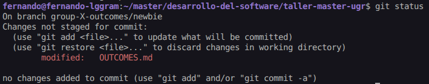
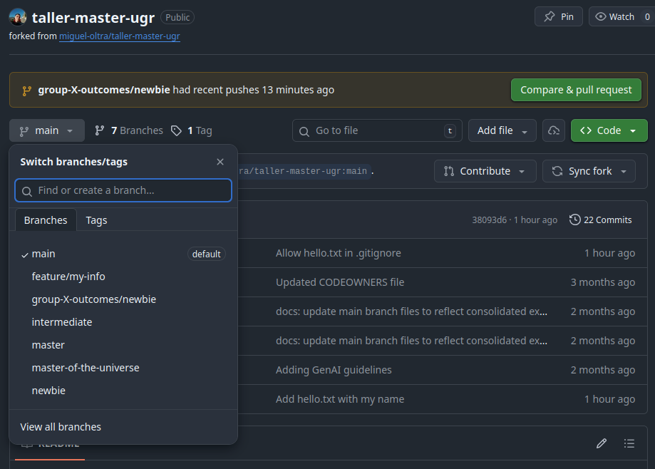

# Exercise Outcomes Submission Template

**Student/Group Name**: Fernando Cuesta Bueno
**Level Completed**: newbie
**Date**: 12 de Febrero de 2026

---

## 📋 Exercise Summary

### Exercise: Newbie

**Status**: ✅ Completed

**What I did**:
En esta introducción a Git hemos realizado la configuración inicial de Git, incluyendo la creación de un repositorio local y la realización de commits básicos. También hemos aprendido a crear ramas y subirlas a un repositorio remoto en GitHub.

**Commands Used**:

```bash
git config --global user.name "Fernando Cuesta"
git config --global user.email "fernandocuestab@gmail.com"
git clone git@github.com:FerniCuesta/taller-master-ugr.git
touch hello.txt
git status
git add hello.txt
git commit -m "Add hello.txt with my name"
git log
git checkout -b feature/my-info
touch my-info.txt
git add my-info.txt
git commit -m "Add personal information"
git remote -v
git remote set-url origin https://github.com/FerniCuesta/taller-master-ugr
git push origin feature/my-info
git checkout newbie
git push -u origin newbie
git pull origin newbie
git checkout -b group-X-outcomes/newbie
git checkout main -- OUTCOME_TEMPLATE.md
```

**Results/Output**:

```bash
$ git checkout
feature/my-info                 master-of-the-universe          origin/master
FETCH_HEAD                      newbie                          origin/master-of-the-universe
HEAD                            ORIG_HEAD                       origin/newbie
intermediate                    origin/HEAD                     v0.0.1
main                            origin/intermediate
master                          origin/main
```

```bash
$ git checkout feature/my-info
Switched to branch 'feature/my-info'
```

```bash
$ git checkout feature/my-info
Switched to branch 'feature/my-info'
```

```bash
$ git add my-info.txt
git commit -m "Add personal information"
[feature/my-info f431f6e] Add personal information
 1 file changed, 3 insertions(+)
 create mode 100644 my-info.txt
```

```bash
$ git push origin feature/my-info
Enumerating objects: 8, done.
Counting objects: 100% (8/8), done.
Delta compression using up to 16 threads
Compressing objects: 100% (6/6), done.
Writing objects: 100% (6/6), 667 bytes | 667.00 KiB/s, done.
Total 6 (delta 3), reused 0 (delta 0), pack-reused 0
remote: Resolving deltas: 100% (3/3), completed with 2 local objects.
remote:
remote: Create a pull request for 'feature/my-info' on GitHub by visiting:
remote:      https://github.com/FerniCuesta/taller-master-ugr/pull/new/feature/my-info
remote:
To github.com:FerniCuesta/taller-master-ugr.git
 * [new branch]      feature/my-info -> feature/my-info
```

```bash
$ git checkout newbie
branch 'newbie' set up to track 'origin/newbie'.
Switched to a new branch 'newbie'
```

```bash
$ git pull origin newbie
From github.com:FerniCuesta/taller-master-ugr
 * branch            newbie     -> FETCH_HEAD
Already up to date.
```

```bash
$ git checkout newbie
Already on 'newbie'
```

```bash
# Rama feature/my-info
$ git log

commit f431f6ea8df7168f5d28c2e5fccc6670c72b2681 (HEAD -> feature/my-info, origin/feature/my-info)
Author: Fernando Cuesta <fernandocuestab@gmail.com>
Date:   Thu Feb 12 22:39:37 2026 +0000

    Add personal information

commit ea6e83b51cdf2cc31e56e6ef2970b9f8f955a12a
Author: Fernando Cuesta <fernandocuestab@gmail.com>
Date:   Thu Feb 12 22:39:29 2026 +0000

    Allow my-*.txt files in .gitignore
```

```bash
# Rama main
$ git log

commit 38093d66e3fa926d3cd46182c9f5febb94ae1672 (HEAD -> main, origin/main, origin/HEAD)
Author: Fernando Cuesta <fernandocuestab@gmail.com>
Date:   Thu Feb 12 22:36:58 2026 +0000

    Allow hello.txt in .gitignore

commit 3b826d642885716fb793fe6383428ebdb9aeb10f
Author: Fernando Cuesta <fernandocuestab@gmail.com>
Date:   Thu Feb 12 22:35:00 2026 +0000

    Add hello.txt with my name

commit 9602351f9c1fe509f5153991511918a200c3664d
Author: Miguel Angel Oltra <miguel.oltra@se.com>
Date:   Mon Dec 22 10:27:09 2025 +0100

    Adding GenAI guidelines
```

```bash
# Rama group-X-outcomes/newbie
$ git log

commit d990c135696002e391281509f7424229cb326dc2 (HEAD -> group-X-outcomes/newbie, origin/group-X-outcomes/newbie)
Author: Fernando Cuesta <fernandocuestab@gmail.com>
Date:   Thu Feb 12 23:57:17 2026 +0000

    docs: Add newbie level exercise outcomes for Group X

commit 360f4a4bc62dce8a00a239d4f5b32b94336fb072 (origin/newbie, newbie)
Author: Miguel Angel Oltra <miguel.oltra@se.com>
Date:   Mon Dec 22 09:41:22 2025 +0100

    refactor: consolidate newbie exercises into single comprehensive exercise

commit 5eedc97b386a1ed53906add09886cae3f46924ae
Author: Miguel Angel Oltra <SESA219665@se.com>
Date:   Sat Nov 29 12:08:59 2025 +0100

    docs: Add submission instructions to newbie level

commit 45e1c318443a778075a76f732824589fd922a845
Author: Miguel Angel Oltra <SESA219665@se.com>
Date:   Sat Nov 29 11:53:59 2025 +0100

    Update README for newbie level exercises

commit dc582031fed7a252a3c583fe16f497dbc9dcedd1
Author: Miguel Angel Oltra <SESA219665@se.com>
Date:   Sat Oct 25 12:14:28 2025 +0200

    Revert "Update README.md"

    This reverts commit e2db1ca85b4c8eca7b31d883744bd3a6f5e444b3.

commit e2db1ca85b4c8eca7b31d883744bd3a6f5e444b3 (tag: v0.0.1)
Author: Miguel A. Oltra <39242642+miguel-oltra@users.noreply.github.com>
Date:   Sat Nov 30 16:54:41 2024 +0100

    Update README.md

commit 3d651c33cdfa92926d7706f05c9258ecd7e992db
Author: Miguel A. Oltra <39242642+miguel-oltra@users.noreply.github.com>
Date:   Sat Nov 30 16:53:44 2024 +0100

    Update README.md

commit 4cc5635bea477d934da36d0de8fb3c6c48ed14d5
Author: Miguel A. Oltra <39242642+miguel-oltra@users.noreply.github.com>
Date:   Sat Nov 30 16:33:07 2024 +0100

    Initial commit

```

```bash
$ git checkout -b group-X-outcomes/newbie
Your branch is up to date with 'origin/newbie'.
Switched to a new branch 'group-X-outcomes/newbie'
```

```bash
$ git branch -a
  feature/my-info
* group-X-outcomes/newbie
  main
  newbie
  remotes/origin/HEAD -> origin/main
  remotes/origin/feature/my-info
  remotes/origin/group-X-outcomes/newbie
  remotes/origin/intermediate
  remotes/origin/main
  remotes/origin/master
  remotes/origin/master-of-the-universe
  remotes/origin/newbie
```

```bash
$ git log --oneline --graph --all
* 0ab09e1 (HEAD -> group-X-outcomes/newbie) docs: update OUTCOME.md
* d990c13 (origin/group-X-outcomes/newbie) docs: Add newbie level exercise outcomes for Group X
* 360f4a4 (origin/newbie, newbie) refactor: consolidate newbie exercises into single comprehensive exercise
* 5eedc97 docs: Add submission instructions to newbie level
* 45e1c31 Update README for newbie level exercises
| * f431f6e (origin/feature/my-info, feature/my-info) Add personal information
| * ea6e83b Allow my-*.txt files in .gitignore
| * 38093d6 (origin/main, origin/HEAD, main) Allow hello.txt in .gitignore
| * 3b826d6 Add hello.txt with my name
| * 9602351 Adding GenAI guidelines
| * 7ad3af4 docs: update main branch files to reflect consolidated exercise structure (1 per level)
| * 4d9131e chore: remove instructor files from repository tracking
| *   adbb307 Merge pull request #9 from miguel-oltra/patch-gitignore-update
| |\
| | * e4709e6 Updated CODEOWNERS file
| | * 2a39a02 chore: add INSTRUCTOR_GUIDE.md to gitignore
| | * 0abdbae chore: add SUMMARY.md to gitignore for instructor files
| |/
| * 88a54ab chore: Add .gitignore to exclude instructor files and sensitive data
| * e39ff08 PROMPT for updated
| * df1cfdd fix: Update CODEOWNERS to allow trainee work while protecting exercise branches
| * a011fad config: Add CODEOWNERS file for code review requirements
| * 769be64 docs: Add complete implementation summary
| * 9d008fa Updated README.MD with guidelines for the exercises
| * f66bf22 docs: Update MODEL_SPEC.MD with PROMPT 2 requirements
| * c24fd57 docs: Add outcome submission process and evaluation criteria
| * ec488d0 Update main README with complete training overview and navigation
|/
| * b0fb9dc (origin/master-of-the-universe) refactor: consolidate master-of-the-universe exercises into single comprehensive exercise
| * d1ef79f docs: Add submission instructions to master-of-the-universe level
| * 5bffa64 Update README for master-of-the-universe level exercises
|/
| * b5d8eb6 (origin/master) refactor: consolidate master exercises into single comprehensive exercise on history rewriting
| * 960a0a6 docs: Add submission instructions to master level
| * f0055a0 Update README for master level exercises
|/
| * 994450b (origin/intermediate) refactor: consolidate intermediate exercises into single comprehensive exercise
| * a1c17e7 docs: Add submission instructions to intermediate level
| * 9f25f7a Update README for intermediate level exercises
|/
* dc58203 Revert "Update README.md"
* e2db1ca (tag: v0.0.1) Update README.md
* 3d651c3 Update README.md
* 4cc5635 Initial commit
```

**Screenshots**:

- Output de `git status`:
  

- Ramas en GitHub:
  

---

## 🎯 Key Learnings

**Main concepts I learned**:

1. Cómo configurar Git con mi nombre y correo electrónico.
2. Cómo clonar un repositorio y subir cambios a un repositorio remoto.
3. Cómo crear ramas y moverme entre ellas.

**Skills I improved**:

- Usar git por terminal, ya que estoy acostumbrado a usar interfaces gráficas.
- Crear una rama en local y subirla a GitHub.
- Crear un fork de un repositorio y trabajar con él.

---

## 🚧 Challenges Faced

### Challenge 1: Clonar el repositorio sin hacer un fork

**Problem**: En la descripción original de la práctica no se menciona que haya que hacer un fork del repositorio, sino que se clona directamente. Esto me llevó a cometer un error al intentar subir mis cambios, ya que no tenía permisos para hacerlo en el repositorio original.

**Solution**: Para resolver este problema, tuve que crear un fork del repositorio en mi cuenta de GitHub, clonar ese fork en mi máquina local, hacer mis cambios allí y luego subirlos a mi fork.

<!-- **Commands/Approach**:

```bash
# Commands or approach used to solve the problem
``` -->

---

### Challenge 2: Subir archivos ubicados en el .gitignore

**Problem**: Tras realizar los pasos que propone la práctica, me di cuenta de que los archivos que había creado (hello.txt y my-info.txt) no se podían committear ni subir al repositorio porque estaban listados en el archivo .gitignore del repositorio, lo que me impedía completar la práctica correctamente.

**Solution**: Para solucionar este problema, tuve que modificar el archivo .gitignore para eliminar las líneas que ignoraban esos archivos, lo que me permitió añadirlos al staging area, hacer commit y subirlos al repositorio remoto.

### Challenge 3: Retos propuestos por el instructor

**Problem**: El instructor propuso algunas cuestiones en cuanto a los retos, estas son las preguntas que me planteó:

- Did you have SSH key issues? How did you resolve them?
- Any confusion about staging vs. committing?
- Problems with push/pull?

**Solution**: No tuve problemas con las claves SSH, ya que ya tenía una configurada en mi máquina. En cuanto a la confusión entre staging y committing, así como a los problemas con push/pull, no tuve ningún problema, ya que estoy acostumbrado a usar Git y tengo experiencia con estas operaciones.

---

## 💭 Personal Reflection

**What surprised me**:
He descubierto que Git es mucho más poderoso y flexible de lo que pensaba. No sabía la cantidad de información que proporciona el comando `git log`.

**What I found most difficult**:
Al llevar años usando interfaces gráficas para Git, me costó acostumbrarme a usar la terminal y recordar los comandos exactos.

**What I found most useful**:
Aprender a crear ramas y subirlas a GitHub es una habilidad fundamental que me será muy útil en cualquier proyecto de desarrollo de software.

**How I would apply this in real projects**:
En mi día a día como desarrollador, usaré (y uso) Git para gestionar el código de mis proyectos, así como para colaborar con otros desarrolladores.

**Cuestiones del instructor**:

- What did you learn about the three-tree architecture (working dir, staging, repo)?

  He aprendido que el área de staging es un espacio intermedio entre el directorio de trabajo y el repositorio, donde se preparan los cambios antes de hacer un commit. Esto permite tener un control más granular sobre qué cambios se incluyen en cada commit.

- When would you use branches in real projects?

  Un caso en el que estoy acostumbrado a usar ramas es cuando estoy trabajando en una nueva funcionalidad o en una corrección de errores. Creo una rama específica para esa tarea, lo que me permite trabajar de forma aislada sin afectar el código principal hasta que esté listo para ser integrado.

- What's the difference between local and remote repositories?

  La diferencia principal es que un repositorio local es el que está en tu máquina, mientras que un repositorio remoto es el que está alojado en un servidor (como GitHub). El repositorio remoto permite compartir el código con otros desarrolladores y colaborar en proyectos.

---

## 📊 Self-Assessment

Rate your confidence level for each topic (1-5, where 5 is very confident):

| Topic               | Confidence (1-5) | Notes                                                                                                                                                                                                                    |
| ------------------- | ---------------- | ------------------------------------------------------------------------------------------------------------------------------------------------------------------------------------------------------------------------ |
| Basic Git commands  | [3]              | Estoy acostumbrado a usar interfaces gráficas, por lo que aún me falta práctica con la terminal.                                                                                                                         |
| Branching & merging | [4]              | Me siento cómodo creando ramas y moviéndome entre ellas, aunque aún me falta práctica con los conflictos de merge.                                                                                                       |
| Remote operations   | [5]              | Me siento muy cómodo trabajando con repositorios remotos, haciendo push y pull.                                                                                                                                          |
| Conflict resolution | [4]              | Hay ocasiones en las que resolver conflictos se me complica, pero en general me siento cómodo con ello.                                                                                                                  |
| History rewriting   | [1]              | Nunca he tenido que reescribir el historial de commits, por lo que no me siento nada seguro con esta práctica.                                                                                                           |
| Git hooks           | [1]              | Nunca he usado Git hooks, por lo que no me siento nada seguro con esta práctica.                                                                                                                                         |
| Security practices  | [2]              | Lo único que he visto de seguridad en Git es el uso herramientas externas que monitorizan el repositorio en busca de posibles vulnerabilidades, pero no tengo experiencia con prácticas de seguridad específicas de Git. |

---

## 🔗 Evidence/Artifacts

**Links to branches/commits**:

- Link to your outcome branch: `https://github.com/FerniCuesta/taller-master-ugr/tree/newbie`
- Key commits demonstrating your work:
  - 3b826d642885716fb793fe6383428ebdb9aeb10f: Add hello.txt with my name
  - f431f6ea8df7168f5d28c2e5fccc6670c72b2681: Add personal information

**Additional files created**:

- File 1: [hello.txt - Archivo de texto con mi nombre. Creado para practicar el realizar un commit y verlo en el historial de commits.]
- File 2: [my-info.txt - Archivo de texto con información personal. Creado para practicar el uso de ramas y subirlas a un repositorio remoto.]

---

## ✅ Completion Checklist

Before submitting, ensure you have:

- [x] Completed the exercise for your chosen level (including all parts)
- [x] Documented all commands used with their outputs
- [x] Described challenges and how you resolved them
- [x] Provided a thoughtful reflection on your learning
- [x] Self-assessed your confidence in each topic
- [x] Pushed your outcome branch to the remote repository
- [] Created a Pull Request (if required by your instructor)

---

## 📝 Additional Comments

[Any additional thoughts, questions, or feedback about the exercises]

---

**Submission Date**: [Date]
**Ready for Review**: ✅ Yes / ❌ No

````

```

```
````
