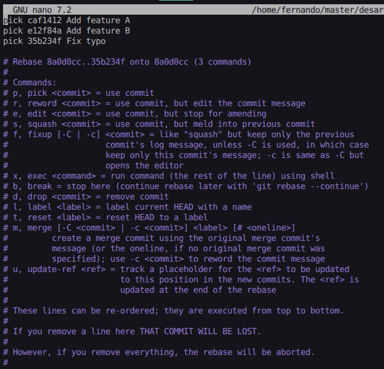
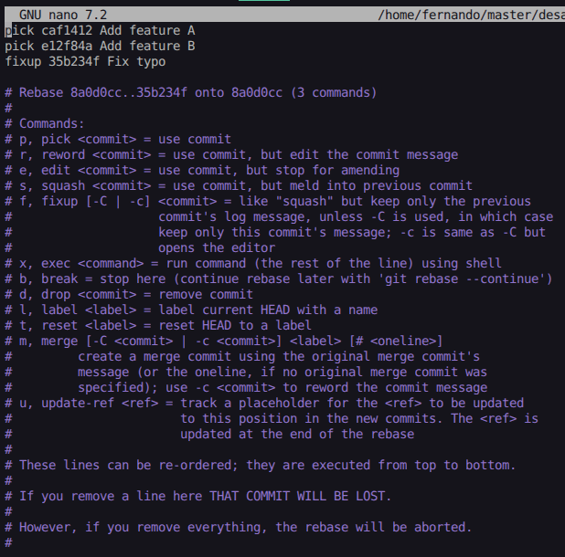

# Exercise Outcomes Submission Template

**Student/Group Name**: Fernando Cuesta Bueno
**Level Completed**: master
**Date**: 13/02/2026

---

## 📋 Exercise Summary

### Exercise: Git Master

**Status**: ✅ Completed

**What I did**:
[Brief description of what you accomplished in this exercise. Since each level has one comprehensive exercise with multiple parts, describe your overall achievement and the key parts you completed.]

**Commands Used**:

```bash
# Complete command history for all operations
$ history
 1283  git checkout master
 1284  echo "version=1.0" > config.txt
 1285  git add config.txt
 1286  git commit -m "Add configuration file"
 1287  echo "environment=production" >> config.txt
 1288  git add config.txt
 1289  git commit --amend -m "Add complete configuration file"
 1290  git log --oneline -n 3
 1291  echo "Feature A" > featureA.txt
 1292  git add featureA.txt
 1293  git commit -m "Add feature A"
 1294  echo "Feature B" > featureB.txt
 1295  git add featureB.txt
 1296  git commit -m "Add feature B"
 1297  echo "Fix typo in A" >> featureA.txt
 1298  git add featureA.txt
 1299  git commit -m "Fix typo"
 1300  git rebase -i HEAD~3
 1301  git log --oneline -n 5
 1302  git checkout -b feature/awesome-feature
 1303  echo "Awesome Feature" > awesome.txt
 1304  git add awesome.txt
 1305  git commit -m "Add awesome feature"
 1306  git checkout master
 1307  echo "Master update" > master-update.txt
 1308  git add master-update.txt
 1309  git commit -m "Update on master branch"
 1310  git checkout feature/awesome-feature
 1311  git rebase master
 1312  git log --graph --oneline --all -n 10
 1313  git checkout master
 1314  git checkout -b group-X-outcomes/master
 1315  git checkout main -- OUTCOME_TEMPLATE.md
 1316  cp OUTCOME_TEMPLATE.md OUTCOMES.md
```

**Results/Output**:

```bash
# Commands used for amend operations
echo "version=1.0" > config.txt
git add config.txt
git commit -m "Add configuration file"
echo "environment=production" >> config.txt
git add config.txt
git commit --amend -m "Add complete configuration file"
```

```
# Git log output before and after amend

```

```
# Comparison of commit SHAs to show history was rewritten
```

```bash
# Commands for interactive rebase
$ git rebase -i HEAD~3
```

```
# Git log output showing cleaned-up history before and after rebase
```

```bash
# Commands for creating feature branch and rebasing onto master
$ git checkout feature/awesome-feature
$ git rebase master
```

```bash
# git log --graph --all --oneline showing linear history after rebase
$ git log --graph --oneline --all -n 10
* e2a3f9e (HEAD -> feature/awesome-feature) Add awesome feature
* cd4e163 (master) Update on master branch
* a75e9ca Add feature B
* caf1412 Add feature A
* 8a0d0cc Add complete configuration file
* b5d8eb6 (origin/master, group-X-outcomes/master) refactor: consolidate master exercises into single comprehensive exercise on history rewriting
* 960a0a6 docs: Add submission instructions to master level
* f0055a0 Update README for master level exercises
| * be2f5cd (origin/group-X-outcomes/intermediate, group-X-outcomes/intermediate) docs: termina la documentacion de intermediate
| * 41467ae docs: Add intermediate level exercise outcomes for Group X
```

**Screenshots**:

- Screenshots del editor de rebase interactivo antes y después de los cambios
- 
- 

---

## 🎯 Key Learnings

**Main concepts I learned**:

1. **Rebase vs Merge**: Rebase reorganiza commits aplicándolos sobre otra rama, creando un historial lineal. Merge crea un commit de fusión que une dos ramas, preservando el historial completo. Rebase es más limpio visualmente pero reescribe historia.

2. **Amend Reescribe Historia**: `git commit --amend` modifica el último commit, cambiando su contenido y SHA. Esto reescribe el historial local, por lo que nunca debe hacerse en commits ya publicados.

3. **SHAs Cambian en Rebase**: Durante rebase, cada commit recibe un nuevo SHA porque cambia su parent commit. Esto demuestra que rebase crea commits nuevos en lugar de mover los existentes.

4. **Peligro de Reescribir Historia Pública**: Reescribir commits compartidos causa desincronización entre repositorios locales. Los colaboradores tendrán commits huérfanos y conflictos al hacer push/pull.

5. **Mejores Prácticas**: Solo reescribir historia local antes de compartir. Usar rebase para limpiar la rama antes de hacer PR. Nunca forzar push en ramas compartidas sin comunicación al equipo.

6. **--force vs --force-with-lease**: `--force` sobrescribe todo sin validar. `--force-with-lease` verifica que el remoto tenga el commit esperado, evitando sobrescribir cambios de otros.

7. **Flujos de Equipo**: Acuerdar si rebasar antes de merge. Usar ramas feature con rebase local, merge en main. Documentar políticas de reescritura para evitar conflictos colaborativos.

**Skills I improved**:

- Lectura y comprensión de registros Git
- Resolución de conflictos de rebase
- Reescritura de historial con rebase y amend

---

## 🚧 Challenges Faced

### Challenge 1: Usando Amend para Reescribir Commits

**Problem**: Al crear el archivo de configuración inicial, olvidé incluir la variable de entorno. Creé un commit con solo `version=1.0`, pero luego necesitaba agregar `environment=production`. Tenía dos opciones: crear un nuevo commit o modificar el anterior.

**Solution**: Utilicé `git commit --amend` para modificar el último commit sin crear uno nuevo. Primero agregué el contenido faltante al archivo `config.txt`, luego ejecuté `git add config.txt` y finalmente `git commit --amend -m "Add complete configuration file"` para incluir ambas líneas en un único commit. De esta manera, el historial quedó limpio con un solo commit que contenía toda la configuración, en lugar de dos commits separados. Esto demuestra cómo reescribir la historia local para mantener los commits limpios y enfocados.

**Commands/Approach**:

```bash
# Crear el archivo inicial con versión
$ echo "version=1.0" > config.txt
$ git add config.txt
$ git commit -m "Add configuration file"
[master 1eca8d9] Add configuration file

# Agregar el contenido faltante
$ echo "environment=production" >> config.txt
$ git add config.txt

# Modificar el commit anterior para incluir ambas líneas
$ git commit --amend -m "Add complete configuration file"
[master 8a0d0cc] Add complete configuration file

# Verificar que el SHA cambió
$ git log --oneline -n 1
8a0d0cc (HEAD -> master) Add complete configuration file
```

---

### Challenge 2: Interactive Rebase para Limpiar Historial

**Problem**: Después de crear varias features (Feature A, Feature B y un fix de typo), el historial tenía tres commits separados. El commit "Fix typo" era realmente una corrección del mismo feature y conceptualmente debería haberse combinado con "Add feature A" para mantener el historial más limpio y lógico.

**Solution**: Ejecuté `git rebase -i HEAD~3` para acceder al editor de rebase interactivo. En el editor vi los tres commits y cambié la instrucción del commit "Fix typo" de `pick` a `squash`, lo que lo combinó con el commit anterior "Add feature A". Esto resultó en un historial más limpio con solo dos commits lógicos en lugar de tres. El resultado fue que el historial quedó reorganizado: el commit de typo desapareció y su contenido se integró en el commit de Feature A.

**Commands/Approach**:

```bash
# Crear los tres commits
$ echo "Feature A" > featureA.txt
$ git add featureA.txt
$ git commit -m "Add feature A"
[master caf1412] Add feature A

$ echo "Feature B" > featureB.txt
$ git add featureB.txt
$ git commit -m "Add feature B"
[master e12f84a] Add feature B

$ echo "Fix typo in A" >> featureA.txt
$ git add featureA.txt
$ git commit -m "Fix typo"
[master 35b234f] Fix typo

# Ejecutar rebase interactivo
$ git rebase -i HEAD~3
# En el editor: cambiar "pick 35b234f" a "squash 35b234f"
Successfully rebased and updated refs/heads/master.

# Ver el historial limpio resultante
$ git log --oneline -n 5
a75e9ca (HEAD -> master) Add feature B
caf1412 Add feature A
8a0d0cc Add complete configuration file
```

---

### Challenge 3: Rebase de Feature Branch sobre Master

**Problem**: Creé una rama feature (`feature/awesome-feature`) con un commit nuevo, pero mientras trabajaba, master también avanzó con un commit adicional ("Update on master branch"). La rama feature estaba basada en una versión antigua de master, lo que resultaría en un historial no lineal si simplemente hiciera merge.

**Solution**: Para mantener un historial lineal y limpio, cambié a la rama feature y ejecuté `git rebase master`. Esto reapplicó el commit de la rama feature encima del último commit de master. El comando fue exitoso sin conflictos porque no había cambios solapados. El resultado fue que la rama feature ahora estaba completamente actualizada con todos los cambios de master, y su commit estaba al frente, creando una línea clara de desarrollo.

**Commands/Approach**:

```bash
# Crear la rama feature
$ git checkout -b feature/awesome-feature
Switched to a new branch 'feature/awesome-feature'
$ echo "Awesome Feature" > awesome.txt
$ git add awesome.txt
$ git commit -m "Add awesome feature"
[feature/awesome-feature 001ceff] Add awesome feature

# Volver a master y crear un nuevo commit
$ git checkout master
Switched to branch 'master'
$ echo "Master update" > master-update.txt
$ git add master-update.txt
$ git commit -m "Update on master branch"
[master cd4e163] Update on master branch

# Rebase de la rama feature sobre master
$ git checkout feature/awesome-feature
Switched to branch 'feature/awesome-feature'
$ git rebase master
Successfully rebased and updated refs/heads/feature/awesome-feature.

# Ver el historial lineal
$ git log --graph --oneline --all -n 10
* e2a3f9e (HEAD -> feature/awesome-feature) Add awesome feature
* cd4e163 (master) Update on master branch
* a75e9ca Add feature B
* caf1412 Add feature A
* 8a0d0cc Add complete configuration file
```

---

### Challenge 4: Diferencia de Commits después de Rebase

**Problem**: Durante los procesos de amend y rebase, noté que los SHAs (identificadores únicos) de los commits cambiaban. Inicialmente esto fue confuso: ¿se estaban perdiendo los commits?, ¿qué pasaba con la historia?

**Solution**: Comprendí que cuando reescribes historia con `amend` o `rebase`, Git crea commits completamente nuevos porque el contenido hash del commit cambia. En el caso de `amend`, el primer commit tenía SHA `1eca8d9`, pero después de agregar contenido y hacer amend, el nuevo SHA fue `8a0d0cc`. Durante el rebase, el commit de awesome feature originalmente era `001ceff`, pero después de rebase sobre master se convirtió en `e2a3f9e`. Esto es normal y esperado: estamos creando una nueva historia, no moviendo commits existentes. Los commits antiguos aún existen en reflog si necesitamos recuperarlos, pero el historial actual refleja la lineage correcta después de las operaciones.

**Commands/Approach**:

```bash
# Ver cómo los SHAs cambian con amend
$ git log --oneline -n 1
8a0d0cc (HEAD -> master) Add complete configuration file
# (originalmente era 1eca8d9)

# Ver cómo los SHAs cambian con rebase
$ git log --oneline -n 1
e2a3f9e (HEAD -> feature/awesome-feature) Add awesome feature
# (originalmente era 001ceff)
```

---

## 💭 Personal Reflection

**What surprised me**:
Lo que más me sorprendió fue descubrir las diferencias entre `rebase` y `merge` en cuanto a cómo manejan el historial. Pensaba que eran simplemente dos formas de hacer lo mismo, pero en realidad son filosofías completamente distintas: merge preserva todo lo que sucedió (incluso los "desvíos"), mientras que rebase reescribe el historial para contar una narrativa lineal y limpia. También me sorprendió demasiado lo fácil que es romper un repositorio compartido si no se entiende cuándo es seguro reescribir historia.

**What I found most difficult**:
El concepto más desafiante fue entender cuándo es seguro reescribir historia y cuándo es peligroso. La línea entre "local" y "compartido" puede ser confusa. Me dio mucha claridad cuando comencé a pensar en términos de "¿Ha visto alguien más este commit?" Si la respuesta es no, estoy seguro. Si es sí, tengo que tener mucho cuidado. También fue difícil visualizar cómo el rebase realmente reapplica commits en lugar de simplemente moverlos, y por eso cambian los SHAs.

**What I found most useful**:
Sin duda, la comprensión de cuándo reescribir historia es seguro vs. peligroso será la habilidad más valiosa. En proyectos profesionales, esto es crítico porque un mal uso de `git push --force` puede deshacer el trabajo de otros desarrolladores. También la práctica con `git rebase -i` para limpiar ramas antes de merge será extremadamente útil para mantener historiales profesionales y legibles.

**How I would apply this in real projects**:
En un equipo profesional, aplicaría estas prácticas así:

1. **Política de Rebase Local**: Antes de hacer push a mi rama feature, usaría `git rebase -i` para limpiar commits, combinando cambios relacionados y eliminando commits de "trabajo en progreso". Esto mantiene el historial de la rama limpio antes de compartirlo.

2. **Rebase en Ramas Privadas**: Solo reescribiría historia en mis ramas feature locales antes de compartirlas. Una vez que hago push (aunque sea a una rama personal), dejo de reescribir esa historia.

3. **Flujo de Merge a Main**: Cuando integro a main/master, usaría `git rebase main` en mi rama feature local para obtener los últimos cambios y mantener un historial limpio, pero luego haría un merge convencional a main para preservar el registro de que esta feature fue fusionada.

4. **Documentar Políticas**: Establecería claramente con el equipo: "Solo reescribimos historia en ramas feature privadas. Main/master jamás es reescrito. Si necesitas cambiar un commit en main, creamos un nuevo commit de revert."

5. **Usar --force-with-lease**: En los raros casos donde debo forzar un push (solo en mis propias ramas), usaría `--force-with-lease` en lugar de `--force` para evitar sobrescribir cambios inesperados de otros.

**Respuestas específicas a las preguntas clave**:

- **¿Cuándo es seguro reescribir historia?**: Solo cuando los commits aún no han sido compartidos públicamente. Esto incluye commits en tu repositorio local y en ramas privadas que solo tú estás usando. Es seguro mientras el commit sea exclusivamente tuyo.

- **¿Cuándo es peligroso?**: Cuando el commit ya ha sido compartido con otros desarrolladores, está en main/master, o en cualquier rama que otros puedan haber clonado y basado trabajo sobre. Reescribir aquí causa conflictos de merge complejos y commits huérfanos.

- **¿Cómo ayuda rebase a crear historiales profesionales?**: Rebase permite que el historial cuente una historia clara y lineal de cómo se desarrolló el proyecto, sin los "ruidos" de merges locales. Ver `git log` después de un buen rebase es como leer una cronología de cambios bien organizada.

- **¿Diferencia fundamental entre rebase y merge?**: Merge es honesto: dice "aquí fusionamos dos historias diferentes en este punto exacto". Con rebase, literalmente reescribimos la historia para pretender que nunca hubo divergencia. Merge es seguro para ramas compartidas; rebase es para limpiar historiales locales.

- **¿Implementación en un equipo profesional?**: Usar rebase para feature branches locales, merge con `--no-ff` a main para crear "etiquetas" de cuándo se integraron features importantes, y nunca, jamás, reescribir main. Si alguien intenta hacer `git push --force` a main, deberían ser detenidos por protecciones de rama en GitHub/GitLab.

---

## 📊 Self-Assessment

Rate your confidence level for each topic (1-5, where 5 is very confident):

| Topic               | Confidence (1-5) | Notes                                                                                                                                                                                                                    |
| ------------------- | ---------------- | ------------------------------------------------------------------------------------------------------------------------------------------------------------------------------------------------------------------------ |
| Basic Git commands  | [4]              | A pesar de haber usado siempre interfaces gráficas, ahora entiendo mejor los comandos subyacentes.                                                                                                                       |
| Branching & merging | [5]              |                                                                                                                                                                                                                          |
| Remote operations   | [5]              |                                                                                                                                                                                                                          |
| Conflict resolution | [5]              |                                                                                                                                                                                                                          |
| History rewriting   | [4]              | Todavía me siento un poco inseguro sobre cuándo exactamente es seguro reescribir historia, pero tengo una buena comprensión general.                                                                                     |
| Git hooks           | [1]              | No he trabajado con hooks en este ejercicio, así que no tengo experiencia práctica.                                                                                                                                      |
| Security practices  | [2]              | Lo único que he visto de seguridad en Git es el uso herramientas externas que monitorizan el repositorio en busca de posibles vulnerabilidades, pero no tengo experiencia con prácticas de seguridad específicas de Git. |

---

## 🔗 Evidence/Artifacts

**Links to branches/commits**:

- Link to your outcome branch: `https://github.com/FerniCuesta/taller-master-ugr/tree/group-X-outcomes/master`
- Key commits demonstrating your work:
  - cd4e1636aef118d67ebf0fa9979baa72daab32e7: Update on master branch
  - a75e9ca33765742273b6d206cbe15fcf7010b8e0: Add feature B
  - caf1412644eb6c8dda1ecbde774c8f9ae9b71339: Add feature A

**Additional files created** (if any):

- **config.txt**: Archivo de configuración que contiene las variables `version=1.0` y `environment=production`. Fue usado para demostrar la operación `git commit --amend`.
- **featureA.txt**: Archivo que representa la Feature A del proyecto. Contiene el texto "Feature A" y fue modificado posteriormente para demostrar la operación de squash en rebase interactivo.
- **featureB.txt**: Archivo que representa la Feature B del proyecto. Contiene el texto "Feature B".
- **master-update.txt**: Archivo creado en la rama master para simular avance en la rama principal mientras se trabajaba en la rama feature.
- **awesome.txt**: Archivo que representa la característica "Awesome Feature" creada en la rama `feature/awesome-feature`. Contiene el texto "Awesome Feature" y fue usado para demostrar el rebase de una rama feature sobre master.

---

## ✅ Completion Checklist

Before submitting, ensure you have:

- [x] Completed the exercise for your chosen level (including all parts)
- [x] Documented all commands used with their outputs
- [x] Described challenges and how you resolved them
- [x] Provided a thoughtful reflection on your learning
- [x] Self-assessed your confidence in each topic
- [x] Pushed your outcome branch to the remote repository
- [ ] Created a Pull Request (if required by your instructor)

---

## 📝 Additional Comments

---

**Submission Date**: 13/02/2026
**Ready for Review**: ✅ Yes
