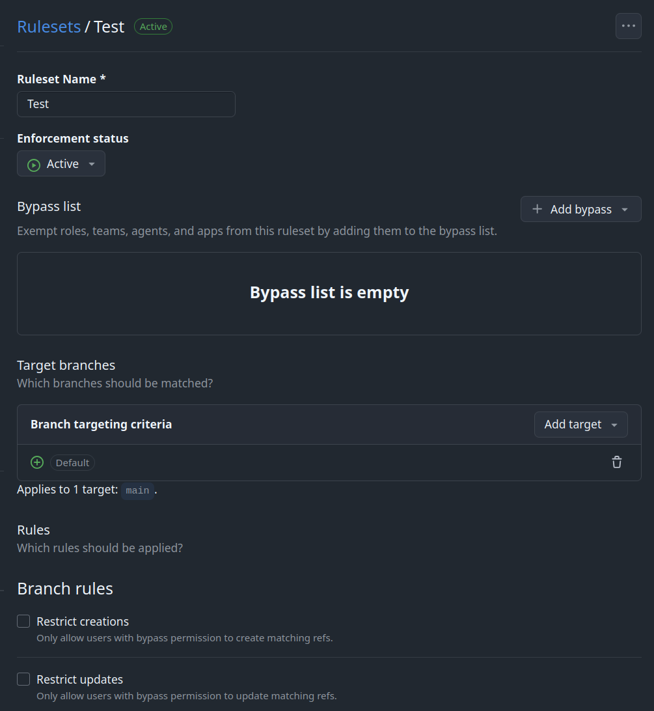
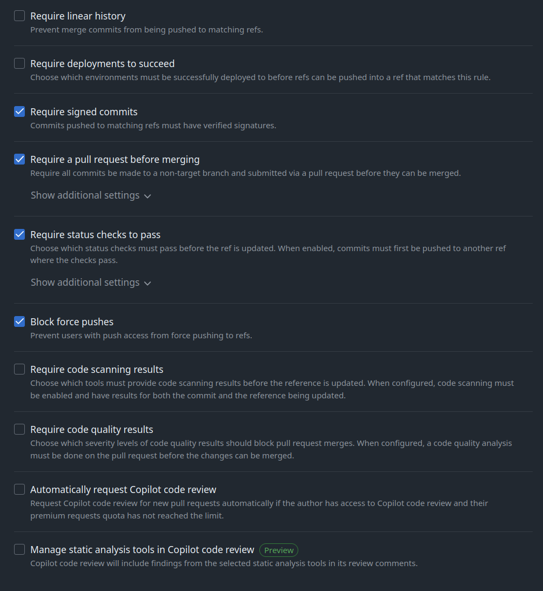
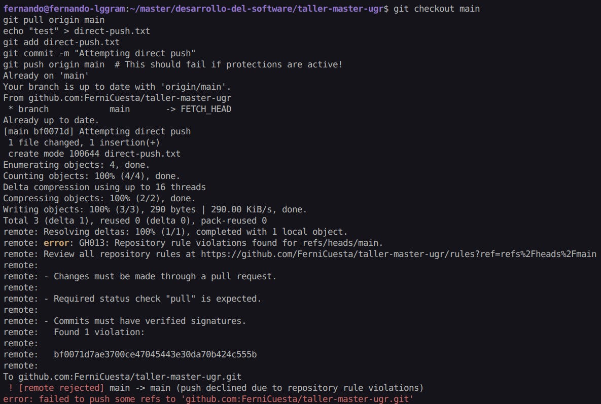
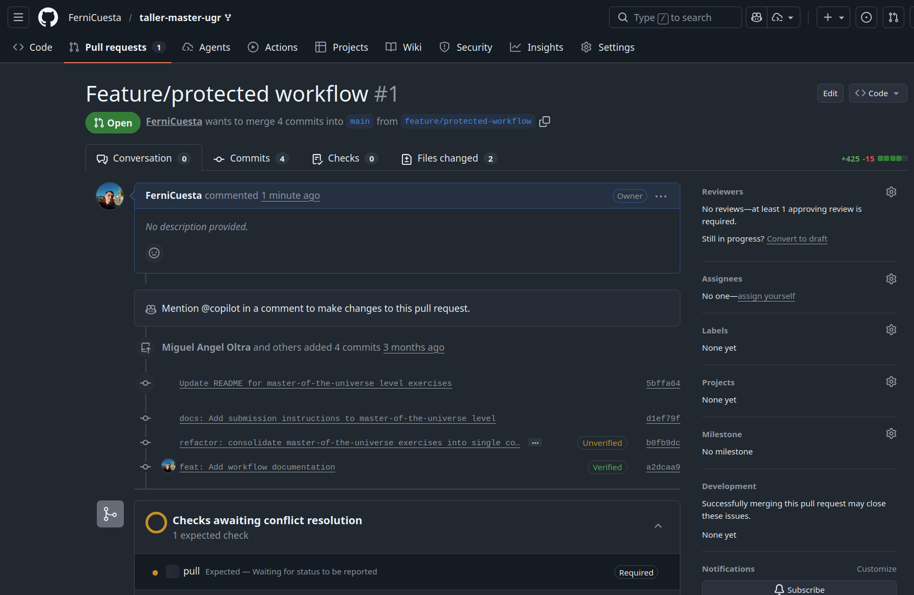
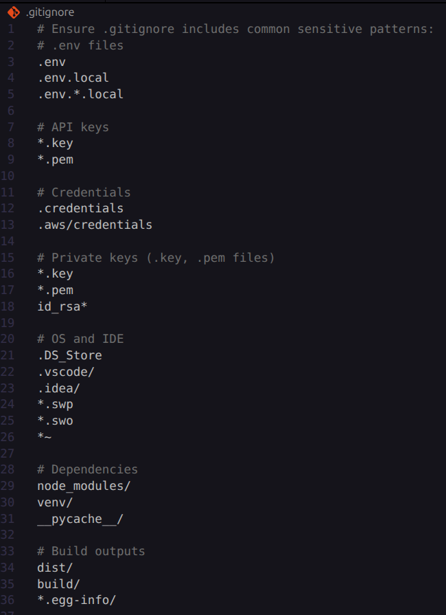

# Exercise Outcomes Submission Template

**Student/Group Name**: Fernando Cuesta Bueno
**Level Completed**: master-of-the-universe  
**Date**: 14/02/2026

---

## 📋 Exercise Summary

### Exercise: Git - Master of the Universe

**Status**: ✅ Completed

**What I did**:
[Brief description of what you accomplished in this exercise. Since each level has one comprehensive exercise with multiple parts, describe your overall achievement and the key parts you completed.]

**Commands Used**:

```bash
$ history
 1209  git checkout main
 1210  git pull origin main
 1211  echo "test" > direct-push.txt
 1212  git add direct-push.txt
 1213  git commit -m "Attempting direct push"
 1214  git push origin main  # This should fail if protections are active!
 1215  git checkout master-of-the-universe
 1216  git checkout -b feature/protected-workflow
 1217  echo "Proper workflow following branch protection" > workflow.txt
 1218  git add workflow.txt
 1219  git commit -S -m "feat: Add workflow documentation"
 1220  git push origin feature/protected-workflow
 1221  echo "Signed commit test 1" > signed-1.txt
 1222  git add signed-1.txt
 1223  git commit -S -m "feat: Add first signed commit"
 1224  echo "Signed commit test 2" > signed-2.txt
 1225  git add signed-2.txt
 1226  git commit -S -m "feat: Add second signed commit"
 1227  git log --show-signature -2
 1228  # Check for sensitive patterns in commit history
 1229  git log -p | grep -i "password\|api_key\|secret\|token" | head -20
 1230  # Check for large files that might contain sensitive data
 1231  git rev-list --objects --all |   git cat-file --batch-check='%(objecttype) %(objectname) %(objectsize) %(rest)' |   sed -n 's/^blob //p' |   sort --numeric-sort --key=2 |   tail -n 10
 1232  git checkout master-of-the-universe
 1233  git checkout -b group-X-outcomes/master-of-the-universe
 1234  git checkout main -- OUTCOME_TEMPLATE.md
 1235  cp OUTCOME_TEMPLATE.md OUTCOMES.md
 1236  history
```

## Parte 1

### Branch Protection Configuration Screenshots

Screenshots de la configuración de protección de ramas en GitHub para la rama `main`:




### Explicación de cada una de las reglas de protección y su propósito:

#### Rule 1: Pull Request Reviews

**Purpose**: Garantizar que todo código sea revisado por al menos otro desarrollador antes de ser integrado en la rama principal, mejorando la calidad del código y previniendo bugs.

**Implementation**:

- Se requiere un Pull Request antes de mergear
- Se requiere al menos 1 aprobación de otro revisor
- Se descartan automáticamente las aprobaciones antiguas cuando se hacen nuevos commits
- Se requiere revisión de los Code Owners (conforme al archivo CODEOWNERS)
- Se requiere resolución de conversaciones antes de mergear

**Impact on Workflow**: Ralentiza el proceso de merge pero incrementa significativamente la calidad del código, la documentación de cambios y el conocimiento compartido del equipo.

#### Rule 2: Signed Commits

**Purpose**: Verificar la autenticidad e integridad de los commits garantizando que provienen de desarrolladores autorizados, proporcionando trazabilidad criptográfica y prevención de suplantación de identidad.

**Implementation**:

- Se requiere que todos los commits sean firmados con GPG
- Los commits deben tener un badge "Verified" en GitHub
- La clave GPG privada debe estar configurada localmente en cada máquina de desarrollo
- La clave GPG pública debe estar agregada a la cuenta de GitHub del desarrollador

**Impact on Workflow**: Añade un paso adicional al hacer commits (firma GPG), pero proporciona garantía criptográfica de autoría y previene commits no autorizados.

#### Rule 3: Status Checks

**Purpose**: Automatizar la validación de calidad mediante la ejecución de pruebas, análisis de código y otras verificaciones antes de permitir el merge, asegurando que el código cumple con estándares mínimos.

**Implementation**:

- Se requiere que todas las verificaciones de estado pasen antes de mergear
- Se requiere que las ramas estén actualizadas con la rama base antes de mergear
- Típicamente incluye: pruebas unitarias, linting, análisis estático, coverage mínimo
- Las reglas se aplican también a administradores del repositorio

**Impact on Workflow**: Previene la integración de código problemático y mantiene la estabilidad de la rama principal, aunque puede ralentizar el desarrollo si las verificaciones son lentas.

### Revisión del Archivo CODEOWNERS

**Ubicación del Archivo**: `/CODEOWNERS`

**Propósito**: Definir la propiedad del código y asignaciones automáticas de solicitudes de revisión en el repositorio, asegurando que los propietarios designados revisen los cambios en sus áreas de responsabilidad.

**Cómo Funciona**:

- Cada línea contiene un patrón de archivo seguido de uno o más propietarios
- Cuando una Pull Request modifica archivos que tienen propietarios asignados, esos propietarios son automáticamente solicitados para revisar
- Si la protección de rama requiere revisiones de propietarios de código, la PR no puede ser fusionada sin su aprobación

**Análisis de la Configuración Actual**:

| Patrón                    | Propietario(s) | Propósito                                  |
| ------------------------- | -------------- | ------------------------------------------ |
| `/CODEOWNERS`             | @miguel-oltra  | Propiedad del archivo de configuración     |
| `/MODEL_SPEC.MD`          | @miguel-oltra  | Especificación del modelo de entrenamiento |
| `/EVALUATION_CRITERIA.md` | @miguel-oltra  | Documento de criterios de evaluación       |
| `/INSTRUCTOR_GUIDE.md`    | @miguel-oltra  | Documentación del instructor               |
| `/SUMMARY.md`             | @miguel-oltra  | Resumen del repositorio                    |
| `[main]` `*`              | @miguel-oltra  | Todos los archivos en la rama principal    |

**Puntos Clave de Aprendizaje**:

1. **Protección de Ramas de Ejercicio**: El archivo CODEOWNERS protege las ramas de ejercicio, no el trabajo de los aprendices. Los aprendices trabajan en forks o ramas de resultados sin restricciones.

2. **Momento de Descubrimiento**: Los aprendices que implementan estrategias de ramificación descubrirán los requisitos de propiedad de código al intentar enviar PRs a ramas protegidas, aprendiendo de forma natural flujos de trabajo de colaboración en el mundo real.

3. **Limitación del Alcance**: La propiedad del código SOLO se aplica al enviar PRs a ramas de ejercicio protegidas. Los aprendices pueden hacer push libremente a:
   - Sus propios forks
   - Ramas de resultados (group-X-outcomes/\*)
   - Ramas de características en su flujo de trabajo

4. **Rol de Miguel Oltra**: Como @miguel-oltra, el propietario del repositorio mantiene control sobre el contenido del ejercicio y la documentación, asegurando la integridad del material de entrenamiento.

**Impacto Profesional**:

- Previene modificaciones accidentales al contenido del ejercicio
- Crea una experiencia de aprendizaje auténtica cuando los aprendices descubren la propiedad del código
- Asegura que solo cambios autorizados lleguen a los materiales de enseñanza principales
- Enseña prácticas de desarrollo colaborativo con revisiones obligatorias

### Balance entre Seguridad y Flujo de Trabajo

**Análisis de Compensaciones**:

El objetivo es encontrar un equilibrio óptimo entre protecciones de seguridad y velocidad de desarrollo. Las medidas de seguridad deben prevenir errores y accesos no autorizados sin obstaculizar excesivamente la productividad del equipo.

**Medidas de Seguridad Implementadas**:

1. **Pull Request Reviews**: Requiere revisión antes del merge, pero puede ralentizar cambios urgentes
2. **Signed Commits**: Garantiza autenticidad, añade overhead mínimo si se configura automatización
3. **Status Checks**: Previene código defectuoso, requiere CI/CD robusto

**Estrategia de Mitigación de Impacto**:

- **Automatización**: Configurar firmas GPG automáticas en la terminal para reducir fricción
- **CI/CD Optimizado**: Mantener las verificaciones rápidas y paralelas
- **Excepciones Documentadas**: Permitir bypass en casos de emergencia con auditoría completa
- **Educación del Equipo**: Capacitar en las herramientas para que se usen eficientemente

**Recomendaciones de Implementación**:

- Comenzar con protecciones básicas y escalar según sea necesario
- Monitorear métricas de tiempo de merge y ajustar reglas
- Revisar periódicamente la efectividad de las protecciones
- Mantener documentación clara de las políticas

---

## Parte 2

### Evidence of blocked direct push attempt

```bash
fernando@fernando-lggram:~/master/desarrollo-del-software/taller-master-ugr$ git checkout main
$ git pull origin main
$ echo "test" > direct-push.txt
$ git add direct-push.txt
$ git commit -m "Attempting direct push"
$ git push origin main  # This should fail if protections are active!
Already on 'main'
Your branch is up to date with 'origin/main'.
From github.com:FerniCuesta/taller-master-ugr
 * branch            main       -> FETCH_HEAD
Already up to date.
[main bf0071d] Attempting direct push
 1 file changed, 1 insertion(+)
 create mode 100644 direct-push.txt
Enumerating objects: 4, done.
Counting objects: 100% (4/4), done.
Delta compression using up to 16 threads
Compressing objects: 100% (2/2), done.
Writing objects: 100% (3/3), 290 bytes | 290.00 KiB/s, done.
Total 3 (delta 1), reused 0 (delta 0), pack-reused 0
remote: Resolving deltas: 100% (1/1), completed with 1 local object.
remote: error: GH013: Repository rule violations found for refs/heads/main.
remote: Review all repository rules at https://github.com/FerniCuesta/taller-master-ugr/rules?ref=refs%2Fheads%2Fmain
remote:
remote: - Changes must be made through a pull request.
remote:
remote: - Required status check "pull" is expected.
remote:
remote: - Commits must have verified signatures.
remote:   Found 1 violation:
remote:
remote:   bf0071d7ae3700ce47045443e30da70b424c555b
remote:
To github.com:FerniCuesta/taller-master-ugr.git
 ! [remote rejected] main -> main (push declined due to repository rule violations)
error: failed to push some refs to 'github.com:FerniCuesta/taller-master-ugr.git'
```

Screenshot del error de push:



### Feature branch and PR creation workflow

```bash
$ git checkout master-of-the-universe
$ git checkout -b feature/protected-workflow
$ echo "Proper workflow following branch protection" > workflow.txt
$ git add workflow.txt
$ git commit -S -m "feat: Add workflow documentation"
$ git push origin feature/protected-workflow
Switched to branch 'master-of-the-universe'
Your branch is up to date with 'origin/master-of-the-universe'.
Switched to a new branch 'feature/protected-workflow'
[feature/protected-workflow a2dcaa9] feat: Add workflow documentation
 1 file changed, 1 insertion(+)
 create mode 100644 workflow.txt
Enumerating objects: 4, done.
Counting objects: 100% (4/4), done.
Delta compression using up to 16 threads
Compressing objects: 100% (2/2), done.
Writing objects: 100% (3/3), 557 bytes | 557.00 KiB/s, done.
Total 3 (delta 0), reused 0 (delta 0), pack-reused 0
remote:
remote: Create a pull request for 'feature/protected-workflow' on GitHub by visiting:
remote:      https://github.com/FerniCuesta/taller-master-ugr/pull/new/feature/protected-workflow
remote:
To github.com:FerniCuesta/taller-master-ugr.git
 * [new branch]      feature/protected-workflow -> feature/protected-workflow
```

### GitHub PR interface showing active protections



### Comprensión de los Requisitos de Aprobación

#### Descripción General de Requisitos de Aprobación

**Configuración de Aprobaciones Requeridas**:

- **Aprobaciones Mínimas**: Se requiere 1 aprobación del Propietario del Código (@miguel-oltra)
- **Descartar Revisiones Antiguas**: Habilitado - Las aprobaciones antiguas se descartan cuando se hacen nuevos commits
- **Requerir Revisión del Propietario del Código**: Habilitado - Debe ser aprobado por el propietario definido en el archivo CODEOWNERS
- **Resolver Conversaciones**: Requerido - Todos los comentarios y sugerencias deben resolverse antes del merge

#### Cómo Funciona el Flujo de Aprobación

1. **Creación del Pull Request**: Cuando se crea un PR contra una rama protegida (main, master-of-the-universe), las reglas de protección de rama se aplican automáticamente

2. **Verificaciones de Estado**: Las siguientes verificaciones de estado deben pasar:
   - Verificación de estado "pull" (verificación de canalización CI/CD)
   - Todas las verificaciones de estado requeridas deben estar en verde antes de la aprobación

3. **Asignación del Propietario del Código**:
   - GitHub solicita automáticamente la revisión de @miguel-oltra basándose en patrones de CODEOWNERS
   - Para archivos que coincidan con patrones en CODEOWNERS, el propietario designado DEBE aprobar

4. **Proceso de Aprobación**:
   - El revisor revisa los cambios de código, pruebas y documentación
   - El revisor puede aprobar, solicitar cambios o comentar
   - Si se solicitan cambios, el autor debe abordarlos e impulsar nuevos commits
   - Las revisiones antiguas se descartan automáticamente en nuevos commits (fuerza re-revisión)
   - Todas las conversaciones de las revisiones deben marcarse como resueltas

5. **Elegibilidad para Merge**:
   - Todas las verificaciones de estado requeridas pasadas ✓
   - Al menos 1 aprobación recibida ✓
   - Todas las conversaciones resueltas ✓
   - Rama actualizada con la rama base ✓
   - Todas las firmas de commits verificadas ✓

---

## Parte 3

### GPG key successfully configured and added to GitHub

Pasos de configuración:

```bash

```

Captura de pantalla de la configuración de la clave GPG en GitHub:

### Minimum 5 signed commits showing "Verified" badge on GitHub

Captura de pantalla de los commits firmados con el badge "Verified":

Hash y descripción de los commits firmados:

- `a2dcaa9` - feat: Add workflow documentation

### git log --show-signature output

```bash
$ git log --show-signature

```

#### Automatic Signing Configuration

**Configuration**:

```bash

```

#### Public Key Location

**Path**: `security-artifacts/`

**Details**:

---

## Parte 4

### .gitignore Review



**Contenido Analizado del .gitignore**:

```
# Ensure .gitignore includes common sensitive patterns:
# .env files
.env
.env.local
.env.*.local

# API keys
*.key
*.pem

# Credentials
.credentials
.aws/credentials

# Private keys (.key, .pem files)
*.key
*.pem
id_rsa*

# OS and IDE
.DS_Store
.vscode/
.idea/
*.swp
*.swo
*~

# Dependencies
node_modules/
venv/
__pycache__/

# Build outputs
dist/
build/
*.egg-info/
```

**Análisis de Patrones de Seguridad**:

| Categoría             | Patrón                                                    | Protege                                                        | Evaluación    |
| --------------------- | --------------------------------------------------------- | -------------------------------------------------------------- | ------------- |
| Variables de Entorno  | `.env`, `.env.local`, `.env.*.local`                      | Credenciales almacenadas en archivos de configuración local    | ✅ Crítico    |
| Claves Criptográficas | `*.key`, `*.pem`, `id_rsa*`                               | Claves privadas SSH, certificados SSL, claves de encriptación  | ✅ Crítico    |
| Credenciales          | `.credentials`, `.aws/credentials`                        | Archivos de credenciales de AWS y otras plataformas            | ✅ Crítico    |
| Archivos del SO       | `.DS_Store`, `.vscode/`, `.idea/`, `*.swp`, `*.swo`, `*~` | Archivos de sistema operativo e IDE que no deben versionarse   | ✅ Importante |
| Dependencias          | `node_modules/`, `venv/`, `__pycache__/`                  | Carpetas de librerías descargadas que aumentan tamaño del repo | ✅ Importante |
| Artefactos de Build   | `dist/`, `build/`, `*.egg-info/`                          | Salidas compiladas y empaquetadas que se regeneran             | ✅ Importante |

### Sensitive Pattern Scan

**Command Used**:

```bash

```

**Results**:

**Patterns Checked**:

- Passwords
- API Keys
- Secrets
- Tokens

### Data Remediation Approaches

**Strategy 1**:

**Strategy 2**:

**Strategy 3**:

#### Credential Rotation Best Practices

**Best Practice 1**:

**Best Practice 2**:

**Best Practice 3**:

---

## Parte 5

### Security Audit and Team Implementation

**Requirements Completed**:

- Security audit findings and recommendations
- GitHub security features documented
- Best practices guide for team implementation
- Professional security mindset demonstrated

#### Security Audit Findings

**Finding 1**:

**Recommendation**:

**Finding 2**:

**Recommendation**:

**Finding 3**:

**Recommendation**:

#### GitHub Security Features

**Feature 1: Branch Protection**

**How to Enable**:

**Best Configuration**:

**Feature 2: Code Scanning**

**How to Enable**:

**Best Configuration**:

**Feature 3: Secret Scanning**

**How to Enable**:

**Best Configuration**:

#### Team Implementation Guide

**Phase 1 - Foundation**:

**Phase 2 - Enhancement**:

**Phase 3 - Monitoring**:

#### Professional Security Mindset

**Key Principles**:

1. **Defense in Depth**:

2. **Principle of Least Privilege**:

3. **Continuous Monitoring**:

4. **Security by Default**:

**Implementation Strategy**:

**Team Communication**:

## 🎯 Key Learnings

**Main concepts I learned**:

1. [Concept 1, e.g., "How to create and switch between branches efficiently"]
2. [Concept 2, e.g., "The difference between merge and rebase"]
3. [Concept 3]

**Skills I improved**:

- [Skill 1, e.g., "Reading and understanding Git logs"]
- [Skill 2, e.g., "Resolving merge conflicts"]
- [Skill 3]

---

## 🚧 Challenges Faced

### Challenge 1: [Brief title]

**Problem**: [Describe the challenge you encountered]

**Solution**: [Explain how you resolved it or what you learned from it]

**Commands/Approach**:

```bash
# Commands or approach used to solve the problem
```

---

### Challenge 2: [Brief title]

**Problem**: [Describe the challenge]

**Solution**: [Your resolution]

---

## 💭 Personal Reflection

**What surprised me**:
[What unexpected things did you discover about Git?]

**What I found most difficult**:
[Which concepts or exercises were most challenging?]

**What I found most useful**:
[Which skills do you think will be most valuable in real projects?]

**How I would apply this in real projects**:
[Describe how you might use these Git skills in professional work]

---

## 📊 Self-Assessment

Rate your confidence level for each topic (1-5, where 5 is very confident):

| Topic               | Confidence (1-5) | Notes |
| ------------------- | ---------------- | ----- |
| Basic Git commands  | [ ]              |       |
| Branching & merging | [ ]              |       |
| Remote operations   | [ ]              |       |
| Conflict resolution | [ ]              |       |
| History rewriting   | [ ]              |       |
| Git hooks           | [ ]              |       |
| Security practices  | [ ]              |       |

---

## 🔗 Evidence/Artifacts

**Links to branches/commits**:

- Link to your outcome branch: `https://github.com/miguel-oltra/taller-master-ugr/tree/group-X-outcomes/[level]`
- Key commits demonstrating your work:
  - Commit hash: [Short description]
  - Commit hash: [Short description]

**Additional files created** (if any):

- File 1: [Description]
- File 2: [Description]

---

## ✅ Completion Checklist

Before submitting, ensure you have:

- [ ] Completed the exercise for your chosen level (including all parts)
- [ ] Documented all commands used with their outputs
- [ ] Described challenges and how you resolved them
- [ ] Provided a thoughtful reflection on your learning
- [ ] Self-assessed your confidence in each topic
- [ ] Pushed your outcome branch to the remote repository
- [ ] Created a Pull Request (if required by your instructor)

---

## 📝 Additional Comments

[Any additional thoughts, questions, or feedback about the exercises]

---

**Submission Date**: [Date]  
**Ready for Review**: ✅ Yes / ❌ No
